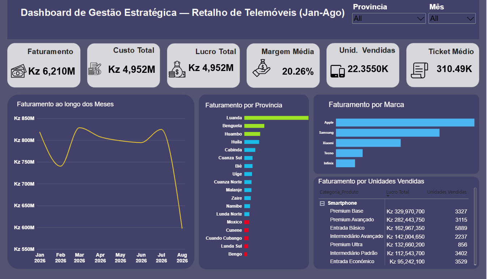

# Case de Consultoria: Dashboard de Gestão Estratégica para Retalho de Telemóveis
##  Consulting Case: Strategic Management Dashboard for Smartphone Retail

[Português] 
Este projeto representa uma solução real de Data Analytics desenvolvida como consultor freelance para uma empresa de retalho de telemóveis a operar no mercado de Angola. O cliente necessitava de centralizar o histórico de 20.000 vendas (Janeiro a Agosto de 2026), que estava disperso e sem padronização, para entender a sua real saúde financeira, a eficiência da equipa de vendas e o comportamento demográfico das províncias. 

A solução foi desenvolvida **100% dentro do Power BI**, cobrindo desde o processo de ETL (tratamento e anonimização de dados dos clientes), modelação dimensional, até à criação de métricas de negócio complexas em DAX e design do painel executivo final.

[English]
This project represents a real-world Data Analytics solution developed as a freelance consultant for a smartphone retail company operating in Angola. The client needed to centralize and standardize a raw database of 20,000 sales records (January to August 2026) to accurately evaluate financial health, sales team efficiency, and regional demographic behavior.

The entire solution was built **100% within Power BI**, covering the full data pipeline: ETL (data cleaning and client data anonymization), dimensional modeling, complex business metrics using DAX, and executive dashboard design.

---

## 🛠️ Desafios Técnicos Solucionados no Power BI / Technical Challenges Solved
*   **LGPD & Anonimização:** Tratamento inicial no Power Query para proteger a privacidade dos clientes da loja, mantendo apenas dados demográficos essenciais.
*   **Tratamento de Dados Brutos (ETL):** Correção de inconsistências severas de digitação humana na coluna de equipamentos e formas de pagamento utilizando funções de string (*Trim* e substituição de caracteres ocultos).
*   **Inteligência de Tempo (Time Intelligence):** Criação de uma tabela Calendário customizada via DAX para analisar o comportamento das vendas ao longo dos meses e calcular variações percentuais de crescimento a curto prazo (MoM%).
*   **Storytelling & Análise Visual:** Implementação de formatação condicional automática por código (DAX) no gráfico de províncias para destacar visualmente o Top 3 mercados geradores de receita (Verde) e os mercados de pior desempenho (Vermelho), facilitando a tomada de decisão do cliente.

---

##  Requisitos do Briefing Respondidos / Client Requirements Fulfilled
1. **Pilar Financeiro:** Automação dos KPIs de Faturamento Total, Lucro Bruto Real, Margem Média Global (%) e Ticket Médio por Transação.
2. **Análise de Portefólio:** Criação de agrupamentos por gamas comerciais (Premium, Intermediário, Entrada) para identificar as subcategorias mais rentáveis e diagnosticar modelos com margens críticas devido a descontos excessivos dos vendedores.
3. **Performance de Equipa:** Cruzamento de dados de faturamento vs. volume físico por colaborador, revelando o vendedor campeão em receita e o campeão em volume.
4. **Distribuição Geográfica:** Mapeamento do desempenho comercial focado nas Províncias de Angola.

---

##  Screenshots / Painel Entregue ao Cliente
### 1. Visão Executiva e Financeira / Executive & Financial View

### 2. Análise de Portefólio de Produtos / Product Portfolio Analysis

---

##  Resultados e Insights Gerados para o Cliente / Business Outcomes
*   **Descoberta de Margem Crítica:** O painel revelou que o modelo iPhone 15 128GB operava com a menor margem da loja (14.94%), alertando o cliente sobre descontos excessivos dados pela equipa comercial neste item Premium.
*   **Sazonalidade Identificada:** Demonstração visual de uma queda acentuada nas vendas a partir de Julho, permitindo ao cliente antecipar estratégias de queima de stock para Agosto.
*   **Otimização de Logística:** Identificação de Luanda, Benguela e Huambo como o Top 3 de sustentação do negócio, direcionando os investimentos de marketing e distribuição do cliente para as regiões de maior retorno.
